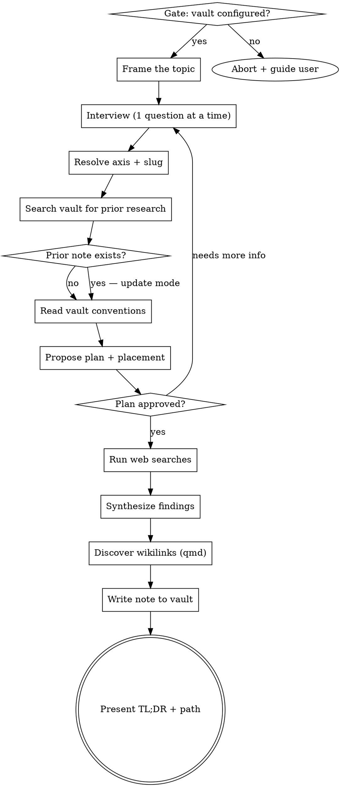

# Research Skill

Turn an arbitrary topic into a well-structured research note in the
vault through a short interview, targeted web searches, and synthesis.
Output is a single `type: research` markdown file placed under the
appropriate structural axis (`repos/`, `areas/`, or `topics/`).

<HARD-GATE>
Do NOT begin web searching or drafting the document until the user has
answered the interview questions AND approved both the research plan
AND the file placement. Skipping the interview produces generic,
low-signal research — every topic goes through this flow regardless
of perceived simplicity.
</HARD-GATE>

## Vault Location

The vault root is `${user_config.vault_path}`.
The qmd collection is `${user_config.vault_collection}`.

If `${user_config.vault_path}` is empty or the directory does not
exist, abort and tell the user to configure the plugin via `/plugins`
→ knowledge-vault → Configure Options. Also offer
`/knowledge-vault:setup-vault` if they do not yet have a vault.

## Inputs

- Topic: `$ARGUMENTS` (if empty, ask the user for the topic before starting)
- Current working directory: !`pwd`
- Today's date: !`date +%Y-%m-%d`

## Checklist

Create a task for each item and complete them in order:

1. **Gate check** — vault configured; abort with guidance if not
2. **Frame the topic** — restate what you heard; flag ambiguity
3. **Interview** — ask clarifying questions one at a time (purpose, scope, audience, constraints, success)
4. **Resolve structural axis** — pick `repos/`, `areas/`, or `topics/` + slug based on the interview
5. **Search vault for prior research** — surface any existing note on this topic; decide create vs update
6. **Read vault conventions** — `STRUCTURE.md`, `TAGS.md`, `FRONTMATTER.md`, `templates/research.md`
7. **Propose research plan** — sub-questions, output structure, target file path; get approval
8. **Dispatch search** — run web searches directly, or delegate to an Agent for broad multi-query research
9. **Synthesize findings** — group by sub-question, note sources, flag disagreements
10. **Discover vault wikilinks** — run qmd searches for named entities in the findings
11. **Write the note** — frontmatter + body per vault conventions at the resolved path
12. **Present summary** — file path, axis, and a 3–5 bullet TL;DR

## Process Flow



## The Process

### Step 1: Gate check

Verify `${user_config.vault_path}` is set and the directory exists. If
not, tell the user:

> The research skill writes into a configured vault. To enable it:
>
> 1. If you don't have a vault yet, run `/knowledge-vault:setup-vault`.
> 2. Otherwise, run `/plugins` → knowledge-vault → Configure Options
>    and set `vault_path` and `vault_collection`.

Stop here. Do not continue.

### Step 2: Frame the topic

Restate the topic in your own words in one sentence. If the topic is a
single noun phrase ("denver", "rust macros") or otherwise ambiguous,
surface that ambiguity before asking questions so the user can redirect.

### Step 3: Interview

Ask questions **one at a time**. Prefer multiple choice when possible.
Keep the interview short — aim for 3–5 questions total. Cover whichever
of these are load-bearing for the topic:

- **Purpose** — why are they researching this? (decision, learning,
  writing, planning) — this also tells you the likely axis
- **Scope** — what's in and out? (geographic, time range, sub-domain,
  depth)
- **Audience / use** — is the doc for them, a team, a blog post, a
  decision memo?
- **Constraints** — budget, timeline, skill level, existing preferences
- **Success criteria** — what does a useful output look like?
  (comparison table, ranked list, pros/cons, step-by-step guide)
- **Known sources / priors** — anything they've already read or ruled out

Stop asking once you have enough to plan meaningfully. Don't grill the
user.

### Step 4: Resolve structural axis

A research note lives under exactly one axis: `repos/`, `areas/`, or
`topics/`.

**Decision order:**

1. **Repo axis hint from `pwd`.** If the basename of `pwd` (or its git
   root) matches an existing directory under
   `${user_config.vault_path}/repos/`, AND the interview purpose is
   tied to that repo (e.g. "evaluating a library for this project"),
   propose that repo as the axis.
2. **Purpose-driven axis.** Otherwise, infer from the interview:
   - **Repo** — research directly supporting code in a specific repo
   - **Area** — research supporting an ongoing life activity (home,
     health, golf, cooking, finance)
   - **Topic** — pure learning not tied to an activity (ai, pkm,
     real-estate, cryptography)
3. **List candidates.** Enumerate existing directories at the proposed
   axis:

   ```bash
   ls ${user_config.vault_path}/<axis>/
   ```

   Pick the best-matching slug, or propose creating a new one.
4. **Confirm with the user.** Present the proposal:

   > **Proposed placement:** `<axis>/<slug>/research/<topic-slug>.md`
   >
   > (or "new <axis>: `<slug>`" if creating)
   >
   > Sound right, or should this go somewhere else?

   Wait for approval. The user can redirect to a different axis or
   slug. If they confirm a new axis/slug, scaffold the hub on write
   (Step 11) — do not create directories speculatively.

**Slug naming:**

- Use the directory name exactly as-is for existing axes.
- For new axes, use a kebab-case slug, 1–3 words, derived from the
  broadest domain (not the topic): `home-search` not
  `best-denver-neighborhoods`.

### Step 5: Search vault for prior research

Check whether a research note on this topic already exists in the vault.
This determines whether to create a new file or update an existing one.

**BM25 (fast, exact terms):**

```bash
qmd search "<de-hyphenated topic>" --json -n 10 -c ${user_config.vault_collection}
```

**Semantic (conceptual):**

```bash
qmd vsearch "<natural-language description of the topic>" --json -n 5 -c ${user_config.vault_collection}
```

> **BM25 query formatting — CRITICAL:** always convert hyphens and
> slashes to spaces before running BM25 queries. BM25 tokenizes on
> hyphens. This does NOT apply to semantic search.

**Create vs update decision:**

- If an existing `type: research` note under the same axis/slug covers
  the same concept → **update it**. Research is rewritable; findings
  accumulate over time with dated entries.
- If the existing note is a different type (`note`, `decision`,
  `session`) covering overlapping material → flag it to the user as
  prior art, but create a new research note.
- If no existing note covers this concept → create a new file.

Present prior art to the user before proposing the plan:

> **Prior vault context:**
>
> - `[[<path>|<Title>]]` — <relevance snippet>
> - `[[<path>|<Title>]]` — <relevance snippet>
>
> I can extend the existing research note, or create a new one. Which
> would you like?

If the user opts to update, switch to update mode for Steps 11–12.

### Step 6: Read vault conventions

Read these files every invocation — do not cache or hardcode their
contents:

- `${user_config.vault_path}/STRUCTURE.md` — type rules and placement
- `${user_config.vault_path}/TAGS.md` — valid tags and tagging rules
- `${user_config.vault_path}/FRONTMATTER.md` — frontmatter formatting
- `${user_config.vault_path}/templates/research.md` — research note template

### Step 7: Propose a research plan

Present a short plan with:

- The 3–7 sub-questions you'll investigate
- The structure the final document will take (headings)
- A rough estimate of how many web searches you'll run
- **The exact target file path** in the vault (or "update existing note
  at …")

Ask for approval or adjustments. Revise if needed. Do not proceed to
web searches until the user explicitly approves.

### Step 8: Dispatch search

Pick the approach that fits the plan:

- **Direct** (default): run `WebSearch` and `WebFetch` yourself for
  3–10 queries. Use this when the topic is narrow or when you want to
  preserve findings in the main conversation.
- **Delegated** (broad topics): dispatch a `general-purpose` Agent
  with the approved plan when research spans many sub-questions or
  would flood the main context with raw search results. Give the
  agent the sub-questions, the required output format (findings
  grouped by sub-question, with source URLs), and ask for a
  structured report.

For each sub-question, collect: key claims, supporting sources (title
+ URL), dates where freshness matters, and any notable disagreement
between sources.

### Step 9: Synthesize

- Group findings by sub-question, not by source
- Prefer recent, reputable sources; note when a claim is contested or
  thin
- Call out gaps — things the user asked about that you couldn't find
  good answers for
- Never invent sources. If you didn't find something, say so.

### Step 10: Discover vault wikilinks

After synthesis, run the wikilink discovery process to find related
vault notes to link from the final write-up. Follow the full process
in [reference/wikilink-discovery.md](reference/wikilink-discovery.md).

If `qmd` is not installed, skip this step entirely and write without
wikilinks.

### Step 11: Write the note

**Target path:**

```
${user_config.vault_path}/<axis>/<slug>/research/<topic-slug>.md
```

Where:

- `<axis>` is `repos`, `areas`, or `topics` (from Step 4)
- `<slug>` is the axis-level slug (from Step 4)
- `<topic-slug>` is 2–5 hyphenated words derived from the topic
  (lowercase, strip punctuation). **Never include "note" or "research"
  in the filename.**

Create the `research/` subdirectory if it doesn't exist:

```bash
mkdir -p ${user_config.vault_path}/<axis>/<slug>/research
```

**If the axis/slug is new** (user confirmed creating a new hub in
Step 4), also scaffold the hub:

```bash
mkdir -p ${user_config.vault_path}/<axis>/<slug>
```

Write a minimal hub note at
`${user_config.vault_path}/<axis>/<slug>/<slug>.md` with
`type: note` and `icon: LiTableOfContents`, following the hub pattern
described in `FRONTMATTER.md`.

**Frontmatter** (build per `FRONTMATTER.md`):

```yaml
---
title: <Human-readable topic title>
description: <1-2 sentence summary of what this investigates>
type: research
status: open           # use "resolved" only if the investigation fully answered the question
question: <The specific question this note is tracking>
tags: [...]            # 0-3 domain tags, all validated against TAGS.md
icon: LiFlaskConical
created: <YYYY-MM-DD>
updated: <YYYY-MM-DD>
<repo|area|topic>: "[[<axis>/<slug>/<slug>|<slug>]]"
---
```

Tag validation follows the rules in `TAGS.md`. If a needed tag isn't
there, apply the three-check protocol from TAGS.md; otherwise fall
back to the closest broader existing tag.

**Body structure** — adapt the vault's `templates/research.md`. A
research note produced by this skill should cover, at minimum:

```markdown
# <Topic>

*Researched <date> · prepared for <audience/purpose>*

## TL;DR

- 3–5 bullets with the headline findings

## Question

<The specific open question this note is tracking — same as the
frontmatter `question:` field, expanded into 1–2 sentences if needed>

## Scope

- What this investigation covers and what it doesn't
- Sub-questions investigated

## Findings (<date>)

### <Sub-question 1>

<Synthesis with inline source links and [[wikilinks]] to related vault
notes discovered in Step 10>

### <Sub-question 2>

...

## Comparison / Recommendation

<Only if the interview implied a decision — a ranked list or comparison
table. Omit otherwise.>

## Open Threads

- Things worth further investigation
- Questions this research raised but didn't answer

## Sources

- [Title](url) — 1-line note on what it contributed
```

**For updates** (existing research note): read the file, then add a
new dated `## Findings (<date>)` section rather than replacing prior
findings. Update `updated:` in frontmatter. Preserve `created:`. Move
`status:` to `resolved` only if the user explicitly says the question
is answered.

**Wikilink insertion:** use the pre-formatted `[[path|Title]]` syntax
from the linking context in Step 10. Place links in running prose on
first mention only. Do not add a separate "Related Notes" section. Do
not force links — a note with zero wikilinks is better than one with
irrelevant ones.

Scale sections to the topic. A single-recommendation doc doesn't need
a comparison table.

### Step 12: Present

Reply with:

- The file path (full vault path)
- Axis and slug (e.g., `areas/home-search`)
- Action taken (created / updated)
- A 3–5 bullet TL;DR lifted from the document
- Number of wikilinks added

Do not dump the whole document into chat.

## Writing Rules

- **Interview first** — no searches until the plan and placement are
  approved
- **One question at a time** — keep the interview crisp
- **Cite everything** — every non-obvious claim gets a source link
- **Flag uncertainty** — contested claims, thin evidence, and gaps
  are features, not bugs
- **Match structure to purpose** — a decision memo looks different
  from a learning guide
- **Don't pad** — if the useful answer is 200 words, the doc is 200
  words
- **Write for future-you** — include enough context to be useful in
  6 months without the original conversation
- **Never guess at wikilinks** — only link to notes confirmed to
  exist via qmd search in Step 10
