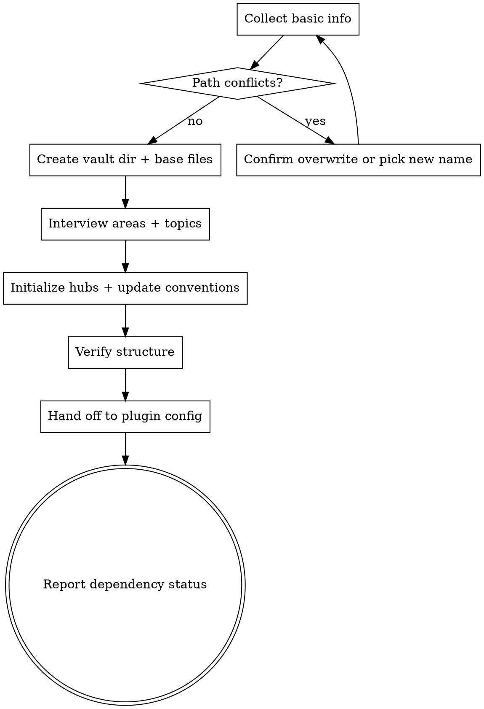

# Setup Vault Skill

Scaffold a personal knowledge vault so the `record`, `session`, and `search` skills can operate.
This skill does NOT install software and does NOT modify plugin config — it creates the vault
directory tree and tells the user what values to set in the plugin config when finished.

## Checklist

You MUST create a task for each of these items and complete them in order. Update task status
(`in_progress` → `completed`) as you move through them.

1. **Collect basic info** — parent path and vault name (used for both directory name and qmd
   collection name)
2. **Create vault directory and base files** — scaffold the tree, write `STRUCTURE.md`, `TAGS.md`,
   `FRONTMATTER.md`, `CLAUDE.md`
3. **Interview: areas and topics** — guide the user through choosing initial structural axes
4. **Initialize area/topic directories** — create hub directories + hub notes; update `TAGS.md` and
   `FRONTMATTER.md` with the user's choices
5. **Hand off to plugin config** — summarize the vault path and collection name and tell the user
   to set them in the plugin config (the skill cannot do this itself)

Then run dependency detection and report any missing tools.

## Process Flow



## The Process

### Task 1: Collect basic info

Ask the user:

1. **Parent directory** for the vault. Default `~`. Must exist and be writable.
2. **Vault name** — a kebab-case slug. This is used for **both**:
   - the vault directory name (`<parent>/<name>`)
   - the qmd collection name

Compute `VAULT_PATH = <parent>/<name>` and `VAULT_COLLECTION = <name>`. Echo both back to the user
for confirmation before proceeding.

**Conflict check.** If `VAULT_PATH` already exists:

- If empty → fine, continue.
- If populated → enumerate existing contents. Ask the user whether to (a) pick a different name,
  (b) reuse the directory in **repair mode** (only fill in what's missing, never overwrite), or
  (c) abort. Default to repair mode if the user is ambiguous.

Do not proceed past this task until both values are locked in.

### Task 2: Create vault directory and base files

Run the scaffolder with the chosen path:

```bash
${CLAUDE_PLUGIN_ROOT}/skills/setup-vault/scripts/scaffold-vault.sh "<VAULT_PATH>"
```

This is idempotent — `mkdir -p` for the tree, only creates `.gitignore` and `README.md` if
missing. It produces:

- `areas/`, `repos/`, `topics/`, `templates/`
- `.gitignore` with sensible defaults
- Empty `README.md` placeholder

Then render the four templated convention files. **Skip any file that already exists** unless the
user opted into overwrite during Task 1 conflict resolution.

| Template                                                               | Output file                |
| ---------------------------------------------------------------------- | -------------------------- |
| [reference/vault-claude-md.md](reference/vault-claude-md.md)           | `<VAULT_PATH>/CLAUDE.md`   |
| [reference/structure-template.md](reference/structure-template.md)     | `<VAULT_PATH>/STRUCTURE.md` |
| [reference/tags-template.md](reference/tags-template.md)               | `<VAULT_PATH>/TAGS.md`     |
| [reference/frontmatter-template.md](reference/frontmatter-template.md) | `<VAULT_PATH>/FRONTMATTER.md` |

Substitution variables available at this stage: `{{vault_collection}}`, `{{today}}`. The
author/areas/topics placeholders are filled in Task 4 once the interview has happened. Either:

- Render now with empty placeholders and re-render in Task 4, or
- Defer rendering of `FRONTMATTER.md` and `TAGS.md` until Task 4.

Prefer the **defer** approach — fewer writes, cleaner history. Render `STRUCTURE.md` and
`CLAUDE.md` now (they only need `{{vault_collection}}` and `{{today}}`).

### Task 3: Interview — areas and topics

> **Methodology reference**: the user will provide a separate doc on how to elicit areas and
> topics. Until that exists, use the lightweight prompts below.

Goal: produce two lists.

- **Areas** — ongoing life domains that produce no code (e.g. `golf`, `finance`, `health`,
  `cooking`). Default suggestions: `work`, `personal`, `learning`. Empty list allowed.
- **Topics** — cross-cutting subjects pursued for learning, not tied to an activity (e.g. `ai`,
  `pkm`, `software-engineering`). Default: empty. Empty list allowed.

Ask for the **author name** and optional **author email** during this task as well — they are
needed when rendering `FRONTMATTER.md` in Task 4.

Confirm the full set of inputs back to the user in one block before moving on:

> **About to scaffold:**
>
> - Vault: `<VAULT_PATH>` (collection: `<VAULT_COLLECTION>`)
> - Author: `<name>` `<email>`
> - Areas: `area1, area2, ...`
> - Topics: `topic1, topic2, ...`
>
> Proceed?

### Task 4: Initialize hubs and update conventions

For each chosen area, create `<VAULT_PATH>/areas/<slug>/` and a hub note
`<VAULT_PATH>/areas/<slug>/<slug>.md` using this frontmatter:

```yaml
---
title: <Slug Titlecased>
description: Hub note for <slug>.
type: note
tags: []
icon: LiTableOfContents
created: <YYYY-MM-DD>
updated: <YYYY-MM-DD>
---

# <Slug Titlecased>
```

Repeat the same pattern for each chosen topic under `<VAULT_PATH>/topics/<slug>/`.

Then render the deferred convention files with all substitutions filled in:

- `FRONTMATTER.md` — `{{author_name}}`, `{{author_email_suffix}}` (e.g. ` (<email>)` or empty),
  `{{vault_collection}}`, `{{today}}`
- `TAGS.md` — `{{today}}`, plus optionally append starter `#<slug>` rows for each chosen area and
  topic in the domain table (one row per slug, scope = "Notes related to <slug>"). Skip the
  append if the user explicitly opted out during the interview.

### Task 5: Verify and hand off

Run the verifier:

```bash
${CLAUDE_PLUGIN_ROOT}/skills/setup-vault/scripts/verify-vault.sh "<VAULT_PATH>"
```

Surface any failures. Then present the hand-off block. **The user must do this step themselves
— the skill cannot write to plugin config:**

> ✅ **Vault scaffolded at `<VAULT_PATH>`.**
>
> To activate the `record`, `session`, and `search` skills, register the vault with the plugin:
>
> 1. Run `/plugins` → **knowledge-vault** → **Configure Options**
> 2. Set `vault_path` to: `<VAULT_PATH>`
> 3. Set `vault_collection` to: `<VAULT_COLLECTION>`
>
> Then re-open the project (or run `/reload-plugins`) for the config to take effect.

### Final step: Report dependency status

Run the detector — never block the hand-off on its result:

```bash
${CLAUDE_PLUGIN_ROOT}/skills/setup-vault/scripts/detect-tools.sh
```

Present each dependency:

- ✅ `qmd` found at `<path>` — search and wikilink discovery will work.
- ⚠️ `qmd` not found — required for `/knowledge-vault:search` and for wikilink discovery in
  `record`/`session`. Install: https://github.com/tobi/qmd
- ✅ Obsidian detected — open `<VAULT_PATH>` to browse.
- ⚠️ Obsidian not detected — recommended for browsing/editing. Install: https://obsidian.md

End with the next-step hint:

> Once configured, try `/knowledge-vault:record` or `/knowledge-vault:session` to capture your
> first note.
